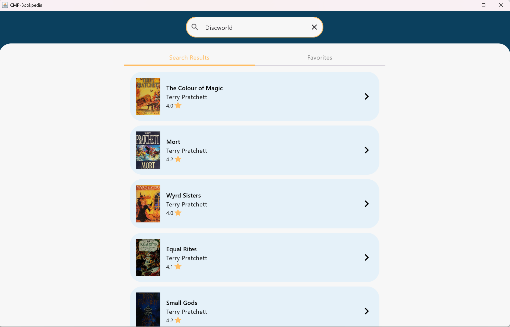
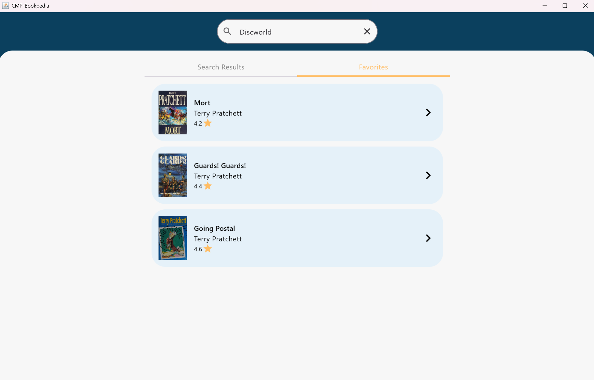
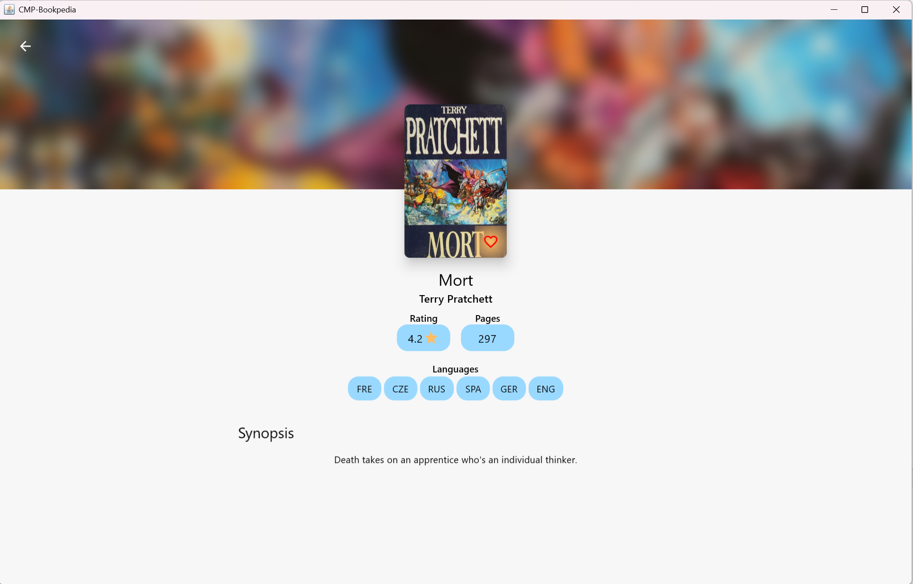
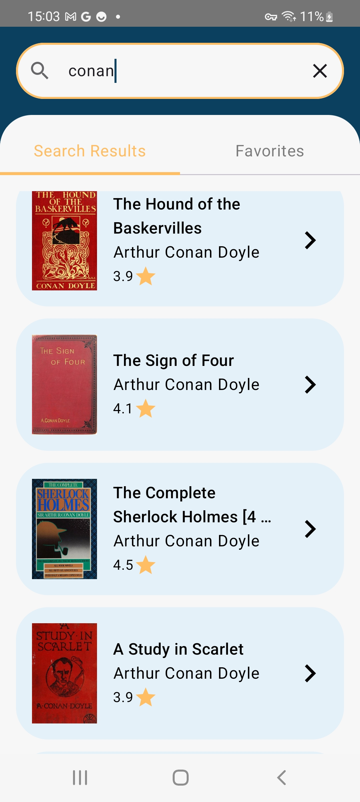
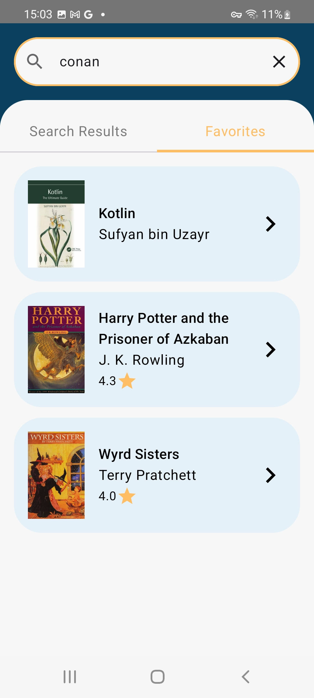
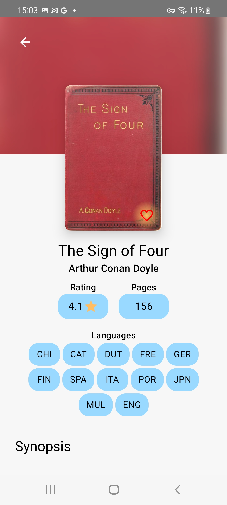

# Hermes-Bookpedia
Book application, where we can browse books

## The Brief

App that searches books from the api openlibrary


## Architecture & Libraries
    - MVI
    - Ktor
    - ROOM Database
    - Dependency Injection - Koin
    - Kotlin Coroutines

## Desktop App preview:

###### To run app use command
```properties
./gradlew run
```

Image #1            |  Image #2             |  Image #3           
:-------------------------:|:----------------------------:|:----------------------------:
    |       |   


## Android App preview:


Image #1            |  Image #2             |  Image #3           
:-------------------------:|:----------------------------:|:----------------------------:
    |       |   
